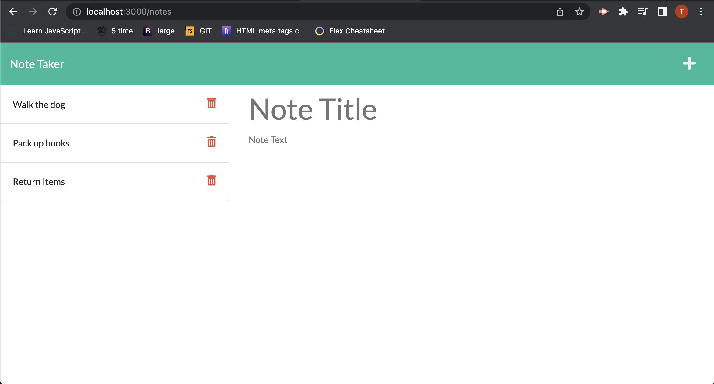

# Note Taker Application

## About 
This application can be used to take notes and save them. Users can add a title and decription to their notes and reference them later. Users can also use this app to take and add multiple notes. The application is also set up so users can delete old notes. 

## How to use this application
1. In your terminal, change into the develop directory of this project.
2. In your terminal, run "node server". The response should be..."listening on port 3000"
3. In your browser, go to "http://localhost:3000/".
4. Click "Get Started"
5. Click the "+" to add note. Add title and body on the left side of the application. 
6. Click the save icon to save your note. It should populate on the right side of the application.
7. To delete your note, click the red trash can icon on the right side of the application (right of your note title and description).

## Screenshots

## Links
https://note-taker-app-2022.herokuapp.com/ 
